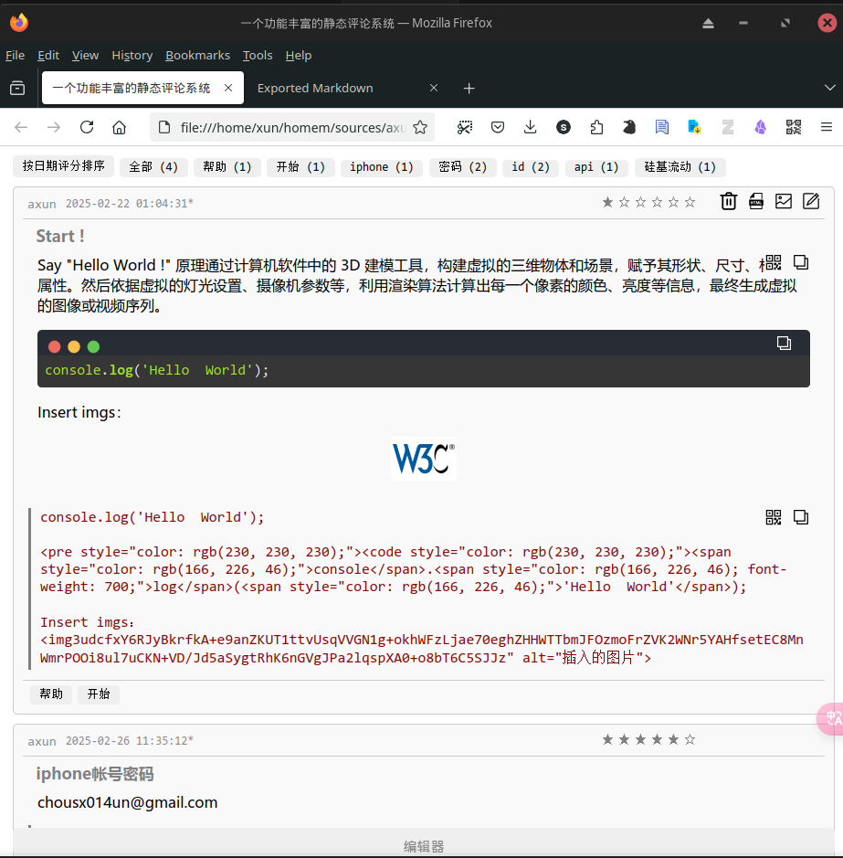
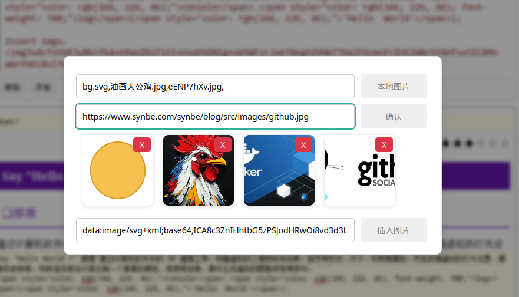

# 一个基于HTML-CSS-JS的静态评论系统

这是一个基于HTML、CSS和JavaScript的静态评论系统，主要用于创建、编辑、管理和导出JSON格式的评论数据。

1. 评论展示界面

   

2. 评论编辑界面:

   

3. 插入图片界面

##### 主要功能和特性

### 1. **核心功能**

- **JSON数据编辑**：用户可以通过表单输入评论的标题、内容、代码、标签、作者等信息，并将其保存为JSON格式的数据。
- **评论展示**：所有评论数据会以卡片形式展示在页面上，支持查看、编辑、删除等操作。
- **数据导出**：支持将评论数据导出为JSON文件或HTML文件，方便保存和分享。

### 2. **主要特性**

- **富文本编辑**：支持Markdown语法，用户可以在评论中使用Markdown格式的文本，系统会自动将其渲染为HTML。
- **代码高亮**：支持插入代码块，并使用`highlight.js`对代码进行语法高亮显示。
- **图片插入**：支持从本地或网络插入图片，图片会被转换为Base64编码并压缩至2MB以下。
- **二维码生成**：可以为评论内容生成二维码，方便分享或快速访问。
- **标签管理**：支持为评论添加标签，并可以根据标签过滤评论。
- **评分系统**：用户可以为评论打分（1-6星），并支持按评分或日期排序。
- **复制功能**：支持复制评论内容或代码块，方便用户快速使用。

### 3. **UI设计**

- **响应式布局**：页面宽度固定为900px，支持自适应屏幕。
- 交互设计：
  - 鼠标悬停时显示操作按钮（如复制、删除、编辑等）。
  - 支持折叠/展开编辑器区域。
  - 提供状态栏提示和弹窗帮助信息。

### 4. **技术实现**

- **HTML**：定义了页面的结构和内容。
- **CSS**：负责页面的样式设计，包括布局、颜色、字体、按钮样式等。
- **JavaScript**：实现核心功能逻辑，包括数据操作、事件处理、二维码生成、图片压缩等。
- 第三方库：
  - `html2canvas`：用于将评论内容导出为图片。
  - `marked`：用于将Markdown文本渲染为HTML。
  - `highlight.js`：用于代码语法高亮。
  - `showdown`：用于Markdown解析。
  - `qrcode-generator`：用于生成二维码。

### 5. **文件结构**

- **HTML**：定义了页面的整体结构，包括编辑器、评论展示区、弹窗等。
- **CSS**：定义了页面的样式，包括布局、按钮、输入框、评论卡片等。
- **JavaScript**：实现了核心功能逻辑，包括数据操作、事件处理、二维码生成、图片压缩等。

### 6. **使用场景**

- **开发者工具**：用于记录和分享代码片段、技术笔记等。
- **评论系统**：用于创建和管理用户评论，支持富文本和图片。
- **数据管理**：用于编辑和导出JSON格式的数据。

### 7. **扩展性**

- **自定义功能**：可以通过修改JavaScript代码添加新功能，如支持更多格式的文本、增加导出格式等。
- **样式定制**：可以通过修改CSS文件调整页面样式，适应不同的设计需求。

总结来说，这个文件是一个功能丰富的JSON数据编辑器，适用于需要记录、管理和分享结构化数据的场景，尤其适合开发者或技术爱好者使用。
